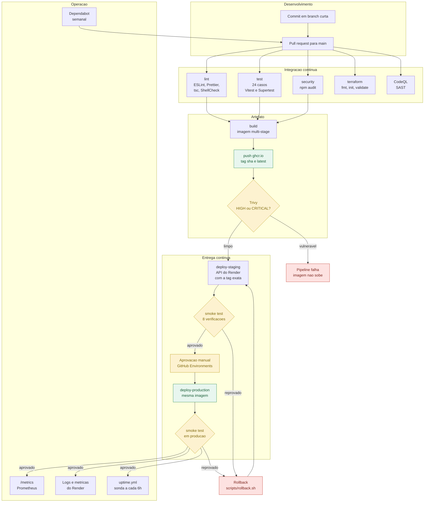

# Fluxo DevOps implementado

Diagrama de todas as etapas, do commit ao monitoramento em producao. Para gerar
a imagem do fluxograma, cole o bloco abaixo em <https://mermaid.live> e exporte
em PNG.

## Etapas em texto

| #   | Etapa                  | Gatilho                         | Resultado                                                |
| --- | ---------------------- | ------------------------------- | -------------------------------------------------------- |
| 1   | Commit e pull request  | trabalho em branch curta        | nenhuma alteracao entra na main sem pipeline             |
| 2   | `lint`                 | push e pull request             | ESLint, Prettier, `tsc --noEmit` e ShellCheck            |
| 3   | `test`                 | push e pull request             | 24 casos de unidade e integracao                         |
| 4   | `security`             | push e pull request             | `npm audit --audit-level=high`                           |
| 5   | `terraform`            | push e pull request             | `fmt -check`, `init -backend=false`, `validate`          |
| 6   | CodeQL                 | push, pull request e semanal    | SAST com a suite security-and-quality                    |
| 7   | `build`                | depende de 2, 3 e 4             | imagem multi-stage publicada em `ghcr.io` com tag do sha |
| 8   | Trivy                  | dentro do `build`               | falha em vulnerabilidade HIGH ou CRITICAL corrigivel     |
| 9   | `deploy-staging`       | push na main                    | API do Render recebe a tag exata da imagem               |
| 10  | Smoke test em staging  | apos o deploy                   | 8 verificacoes contra a URL publica                      |
| 11  | Aprovacao manual       | ambiente `production` protegido | job pendente ate o revisor autorizar                     |
| 12  | `deploy-production`    | apos a aprovacao                | mesma imagem promovida, sem rebuild                      |
| 13  | Smoke test em producao | apos o deploy                   | confirma a versao no ar                                  |
| 14  | Monitoramento          | continuo                        | `/metrics`, painel do Render e `uptime.yml`              |
| 15  | Rollback               | sob demanda                     | `scripts/rollback.sh` aponta a tag anterior              |
